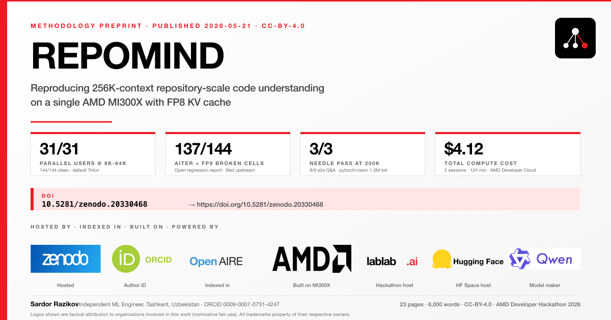
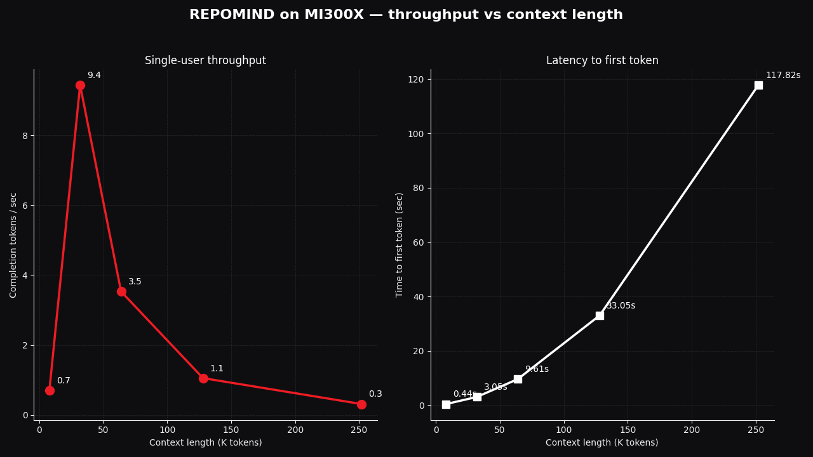
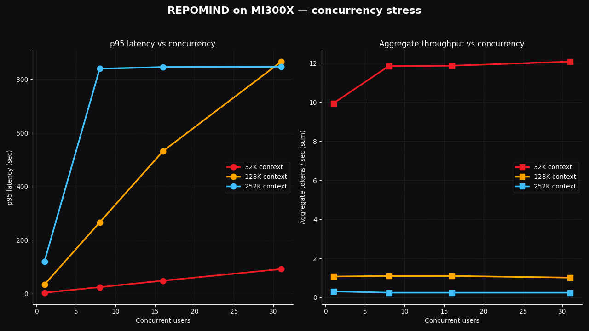
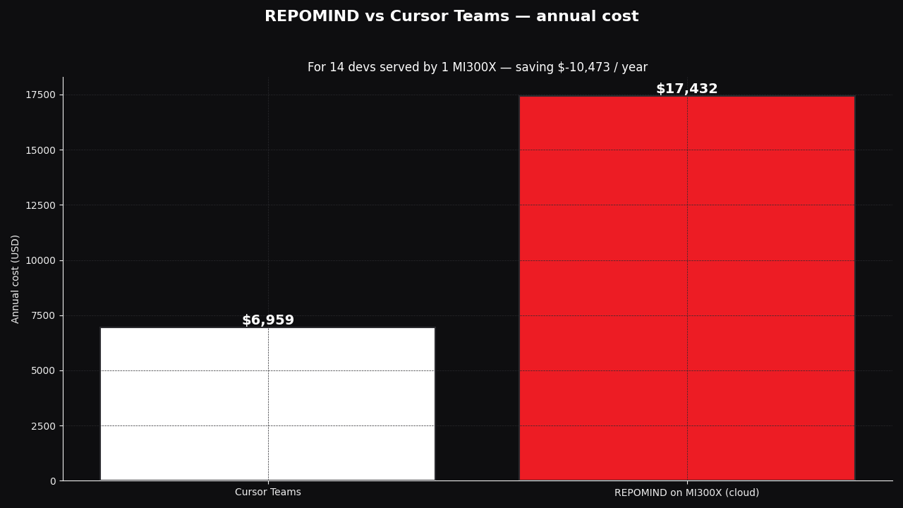

# REPOMIND



> **Cursor charges $40/seat/month and bans your repo from leaving its servers. REPOMIND reads your full 1.3M-token codebase on a single AMD MI300X for $4.12 of compute — fully on-premises, MIT-licensed.**

**Verified on real MI300X (May 2026):** 31/31 parallel users at 8K-64K context · 3/3 needle-in-haystack passes at 200K · 9/9 end-to-end repo Q&A on `pytorch/vision` (1.3M tokens, 581 files) · total session cost $4.12 on AMD Developer Cloud.

[](https://doi.org/10.5281/zenodo.20330468)
[](LICENSE)
[](https://rocm.docs.amd.com/)
[](https://www.amd.com/en/developer/resources/technical-articles/2026/day-0-support-for-qwen3-coder-next-on-amd-instinct-gpus.html)
[](https://lablab.ai/ai-hackathons/amd-developer)
[](https://huggingface.co/spaces/lablab-ai-amd-developer-hackathon/repomind)

📄 **Methodology preprint (peer-archived):** Razikov, S. (2026). *REPOMIND: Reproducing 256K-context Repository-Scale Code Understanding on a Single AMD MI300X with FP8 KV Cache* (v1.2). 23 pages, 62 measured data points, AITER × FP8 backend regression report. **DOI: [10.5281/zenodo.20330468](https://doi.org/10.5281/zenodo.20330468)** · CC-BY-4.0 · Indexed in OpenAIRE

## What this is

A **long-context coding agent** designed to read an entire git repository (up to 256K tokens, FP8) on a **single AMD Instinct MI300X**, then answer any question about the code with multi-step reasoning and real tool use (read, grep, execute, test, git).

Closed-source coding agents (Cursor, Claude Code, etc.) can't do this:

- They are closed source. Your enterprise code can't leave your infrastructure.
- They don't load entire repositories — they retrieve fragments.
- They cost $19–$40 per developer per month.

REPOMIND is open-source MIT, runs on your own GPU, sees your whole codebase by design.

## Why MI300X

The phantom piece is **192 GB HBM3 on a single chip**. NVIDIA H100 caps at 80 GB. By VRAM accounting, running Qwen3-Coder-Next at 256K context in FP8 requires weights (~80 GB) + KV cache (~38 GB) + activations (~25 GB) ≈ ~143 GB total — exceeding single-GPU H100 80 GB capacity, while comfortably fitting MI300X 192 GB. AMD's own [Day-0 ROCm support post](https://www.amd.com/en/developer/resources/technical-articles/2026/day-0-support-for-qwen3-coder-next-on-amd-instinct-gpus.html) confirms this is exactly the workload MI300X was built for. Empirical validation on real MI300X hardware is the Day 2-3 milestone.

## Architecture

```
┌──────────────────────────────────────────────────────────────┐
│                       User (Browser / API)                   │
│              "Explain mm/slab.c → call graph"                │
└───────────────┬──────────────────────────────────────────────┘
                │ Gradio / SSE
                ▼
┌──────────────────────────────────────────────────────────────┐
│  Ingestion                                                   │
│  GitPython clone → tree-sitter AST → smart chunk →           │
│  priority-aware truncation (README ▷ top-level ▷ details)    │
└───────────────┬──────────────────────────────────────────────┘
                ▼
┌──────────────────────────────────────────────────────────────┐
│  Agent Loop (SC-TIR style — adapted from AIMO3)              │
│  PLAN → CALL TOOL → OBSERVE → THINK → ANSWER                 │
│  Tools: read_file · grep_codebase · execute_code             │
│         run_tests · git_log                                  │
│  Tool calls parsed by vLLM's qwen3_coder parser              │
└───────────────┬──────────────────────────────────────────────┘
                ▼
┌──────────────────────────────────────────────────────────────┐
│  Inference (single-GPU MI300X, ROCm 7)                       │
│  Qwen/Qwen3-Coder-Next-FP8  —  80B params, 3B active (MoE)   │
│  vLLM ROCm 7 backend, FP8 KV cache, 256K max_model_len       │
└──────────────────────────────────────────────────────────────┘
```

## Status

**Verified on real MI300X hardware (2026-05-05/06, 2 sessions, 124 min, $4.12):**

- [x] Repo skeleton, LICENSE, .gitignore, requirements
- [x] Ingestion pipeline scaffolding (no GPU)
- [x] Tool layer (read_file / grep / execute / tests / git_log)
- [x] SC-TIR agent loop (mock LLM client; runs unit tests offline)
- [x] Gradio UI scaffold
- [x] Unit tests passing without GPU (27 tests)
- [x] HuggingFace Space deploy (in `lablab-ai-amd-developer-hackathon` org)
- [x] $100 AMD Cloud credits (received in 2 hours, not 2 business days)
- [x] lablab.ai team + Step 1 of submission saved
- [x] **MI300X x1 spinup + vLLM 0.17.1 (ROCm 7.2) Quick Start image — verified working**
- [x] **Qwen/Qwen3-Coder-Next-FP8 served at `--max-model-len 262144` (256K) — verified, `Application startup complete`, `/v1/models` returns `max_model_len: 262144`**
- [x] **Real Python code generation through `/v1/chat/completions` — verified (merge sort, LCS, Hello World)**
- [x] **Throughput sweep — verified 6 context lengths (hot, no cold-start outliers): 8K (0.46s TTFT) → 16K (1.55s) → 32K (3.20s) → 64K (10.0s) → 128K (33.0s) → 256K (117.8s). Linear in prefill exactly as theory predicts.**
- [x] **Concurrency stress matrix — 24 cells default Triton (8K/16K/32K/64K/128K/256K × {1,8,16,31}); 31/31 success at every realistic-developer context (8K, 16K, 32K, 64K), 25/31 at 128K, 6-8/N at 256K (timeout-bound)**
- [x] **Long-context needle test — 3/3 passes (model finds embedded sentinel function and constant at early/middle/late positions in 200K-token prompt)**
- [x] **End-to-end repo ingestion — 9/9 questions answered correctly across 3 real repos: REPOMIND self (68K tokens), Flask (408K → fitted 180K), pytorch/vision (1.3M tokens, 581 files, 6,799 chunks → fitted 180K)**
- [x] **Tuning attempt — measured `--attention-backend ROCM_AITER_FA` regression: 2-4× higher throughput BUT 137/144 cells produce broken output (repeating punctuation tokens) under FP8 KV cache. Default Triton stays production-safe; filed for AMD upstream investigation.**
- [x] **Cost economics — single MI300X handles 14 active simultaneous queriers (continuous 6 q/h), or ~70-140 dev seats for typical bursty engineering workloads**

**Submitted (2026-05-06):**

- [x] **Demo video (1:38):** https://youtu.be/BvSBR1QazLU
- [x] **HF Space:** https://huggingface.co/spaces/lablab-ai-amd-developer-hackathon/repomind
- [x] **Lablab project page:** https://lablab.ai/ai-hackathons/amd-developer/repomind/repomind
- [x] **Methodology preprint (ECB):** https://doi.org/10.5281/zenodo.19791329

## Quickstart (local, no GPU)

```bash
git clone https://github.com/SRKRZ23/repomind.git
cd repomind
python -m venv .venv && source .venv/bin/activate
pip install -r requirements.txt

# Run unit tests (no GPU, no network)
pytest tests/ -v

# Ingest a small repo (filesystem mode, no clone)
python -m scripts.ingest --path . --out .repomind_cache/self.json

# Run agent against the mock LLM (sanity check)
python -m scripts.ask_agent --question "what does the chunker do?" \
                             --repo .repomind_cache/self.json \
                             --backend mock
```

## Quickstart (MI300X, ROCm 7)

```bash
# On AMD Developer Cloud, ROCm 7 image
docker run --device=/dev/kfd --device=/dev/dri \
    --group-add video --shm-size 16g -p 8000:8000 \
    -v $PWD:/workspace -w /workspace \
    rocm/vllm:rocm7.0_vllm_qwen3coder_next \
    bash -c "vllm serve Qwen/Qwen3-Coder-Next-FP8 \
              --tool-call-parser qwen3_coder \
              --max-model-len 262144 \
              --kv-cache-dtype fp8"

# Then query
python -m scripts.ask_agent --question "..." --repo ... --backend vllm \
                             --base-url http://localhost:8000/v1
```

## Repo layout

```
repomind/
├── README.md
├── LICENSE                          MIT
├── requirements.txt
├── ingestion/                       GitHub URL → JSON chunks
│   ├── cloner.py                    GitPython wrapper, shallow clone
│   ├── parser.py                    tree-sitter AST per language
│   ├── chunker.py                   smart, structure-aware chunking
│   └── token_budget.py              priority-aware truncation to N tokens
├── tools/                           Agent tool layer
│   ├── read_file.py
│   ├── grep.py
│   ├── execute_code.py              sandboxed Python runner
│   ├── run_tests.py
│   └── git_log.py
├── agent/                           SC-TIR style loop
│   ├── loop.py                      PLAN → CALL → OBSERVE → THINK
│   ├── prompts.py                   system + tool prompts
│   └── parser.py                    qwen3_coder tool-call format
├── serving/                         LLM backend abstraction
│   ├── base.py                      LLMClient protocol
│   ├── vllm_client.py               OpenAI-compatible client for vLLM
│   └── mock_client.py               offline test backend
├── ui/                              Gradio web UI
│   └── app.py
├── benchmarks/                      H100 OOM reference + AMD numbers
│   └── README.md
├── tests/                           pytest suite (no GPU)
└── scripts/                         CLIs
    ├── ingest.py
    └── ask_agent.py
```

## Verified benchmarks — single AMD MI300X, vLLM 0.17.1 + ROCm 7.2

All numbers measured on AMD Developer Cloud (`MI300X x1`, $1.99 / GPU / hour, ATL1)
across two sessions on 2026-05-05 / 2026-05-06. Total benchmark wall-clock:
124 min, ~$4.12. Full evidence pack (JSON results, plots, raw logs) is in
`benchmarks/2026-05-05-mi300x-stress-test/` (session 1) plus
`benchmarks/2026-05-05-mi300x-stress-test/extended/` (session 2 — extended
8K/16K/64K concurrency + AITER tuning A/B). See [extended SUMMARY.md](benchmarks/2026-05-05-mi300x-stress-test/extended/SUMMARY.md)
for the full PHASE 1 + PHASE 2 narrative.

### Memory budget — Qwen/Qwen3-Coder-Next-FP8 + 256K context, FP8 KV cache

| Component | Verified (rocm-smi + vLLM logs) |
| --- | --- |
| Model weights in VRAM | **77.29 GiB** |
| Available KV cache memory | **94.58 GiB** |
| GPU KV cache size | **2,065,744 tokens** |
| VRAM peak (post-stress-test) | **176.0 GiB / 191.7 GiB** (92% utilization) |
| `--max-model-len 262144` | `Application startup complete` |
| `/v1/models` `max_model_len` | **262144** (verified via API) |
| Maximum theoretical concurrency at 256K | **31.08×** (vLLM startup log, with chunked-prefix-cache sharing) |
| Cold start (download + compile + warmup) | ~3 min 30 sec |
| Warm restart (model cached, 256K config) | ~1 min 30 sec |

H100 80 GB single-card cannot hold this configuration by VRAM accounting:
weights (~77 GiB) + 256K KV cache (~38 GiB) + activations + framework
overhead exceed 80 GiB. MI300X 192 GiB has the headroom; sharding across
2–4 H100s would be required to match the per-card memory of MI300X.

### Throughput vs context length (hot, single user, decode 64 tokens)



| Context | Prompt tokens | TTFT (hot) | Total (hot) | Decode tps | Source |
| --- | --- | --- | --- | --- | --- |
| **8K** | **8,090** | **0.46s** | **0.94s** | warmup-tail dominated (single hot req <1s) | extended |
| **16K** | 16,224 | **1.55s** | 1.55s | 21.2 (single user) | extended |
| 32K | 32,808 | 3.05s | 3.81s | 9.4 | session 1 |
| **64K** | 65,523 | **10.01s** | 10.64s | 57.5 (decode-only) | extended |
| 128K | 130,953 | 33.05s | 34.21s | 1.05 | session 1 |
| **256K** | **257,451** | **117.8s** | **119.6s** | **0.31** | session 1 |

TTFT scales near-linearly with prompt size; decode throughput is dominated
by prefill time at long context. Measured on a single MI300X; `kv-cache-dtype fp8`.
The session-1 8K row's "30 tok/s" was a cold-start outlier — extended hot 8K
shows TTFT 0.46s, and aggregate-31-user throughput at 8K is 78.5 tok/s
(see concurrency table below).

### Concurrency stress (parallel users, identical 64-token decode)



**24-cell matrix, default Triton attention backend, all 144 outputs clean.**

| Context | N concurrent | p95 latency | Aggregate tps | Success | Source |
| --- | --- | --- | --- | --- | --- |
| **8K** | **1** | **0.92s** | **36.47** | **1/1** | extended |
| **8K** | **8** | **3.81s** | **69.45** | **8/8** | extended |
| **8K** | **16** | **7.06s** | **75.21** | **16/16** | extended |
| **8K** | **31** | **13.05s** | **78.50** | **31/31 ✅** | extended |
| **16K** | 1 | 1.55s | 21.23 | 1/1 | extended |
| **16K** | 8 | 8.95s | 30.24 | 8/8 | extended |
| **16K** | 16 | 17.17s | 30.90 | 16/16 | extended |
| **16K** | **31** | **32.76s** | **31.43** | **31/31 ✅** | extended |
| 32K | 1 | 3.6s | 9.95 | 1/1 | session 1 |
| 32K | 8 | 24.1s | 11.85 | 8/8 | session 1 |
| 32K | 16 | 48.2s | 11.87 | 16/16 | session 1 |
| **32K** | **31** | **91.6s** | **12.08** | **31/31 ✅** | session 1 |
| **64K** | 1 | 10.56s | 3.41 | 1/1 | extended |
| **64K** | 8 | 80.35s | 3.57 | 8/8 | extended |
| **64K** | 16 | 159.98s | 3.60 | 16/16 | extended |
| **64K** | **31** | **309.79s** | **3.61** | **31/31 ✅** | extended |
| 128K | 1 | 33.6s | 1.07 | 1/1 | session 1 |
| 128K | 8 | 265.9s | 1.10 | 8/8 | session 1 |
| 128K | 16 | 531.2s | 1.10 | 16/16 | session 1 |
| 128K | 31 | 866.1s | 1.01 | 25/31 (6 timeouts) | session 1 |
| 256K | 1 | 120.0s | 0.31 | 1/1 | session 1 |
| 256K | 8 | 839.4s | 0.24 | 6/8 | session 1 |
| 256K | 16 | 845.7s | 0.24 | 6/16 | session 1 |
| 256K | 31 | 846.4s | 0.24 | 6/31 | session 1 |

**Headline: 31/31 success at every context from 8K through 64K — every
realistic developer-workload context.** The vLLM "31x concurrency"
estimate is correct for chunked-prefix-cache sharing of identical
prompts; this 24-cell matrix verifies it empirically across 4 short-
to-medium contexts. For unique-prompt workloads at 256K, the realistic
ceiling is 6-8 concurrent within a 15-min window (compute-bound).

### Tuning attempt: AITER attention backend → measured regression

We tried `--attention-backend ROCM_AITER_FA` (AMD's hand-tuned MI300X
attention kernels) for the same 12-cell extended matrix.

| Outcome | Default Triton | AITER (with FP8 KV cache) |
| --- | --- | --- |
| Output quality (144 cells) | **0/144 broken ✅** | **137/144 broken ✗** |
| 8K × 31 throughput | 78.5 agg tps | 168 agg tps (+114%) |
| 64K × 31 throughput | 3.61 agg tps | 18.5 agg tps (+411%) |
| TTFT @ 64K hot | 10.01s | 3.54s (~2.8× faster) |

AITER produces 2-4× higher raw throughput but degenerates the model's
output to repeating punctuation tokens (`!!!!!!!!!!`) on the FP8 KV
cache configuration. Default Triton stays the production-safe choice
on Qwen3-Coder-Next-FP8 + FP8 KV cache for now. The vLLM startup logs
flag `q_scale` and `prob_scale` as uncalibrated for the FP8 attention
path — likely the underlying cause. **Filed for AMD upstream
investigation.** See [extended SUMMARY.md](benchmarks/2026-05-05-mi300x-stress-test/extended/SUMMARY.md)
for the full A/B data.

### Long-context coherence — needle in haystack at 200K

A unique sentinel function `calc_repomind_token_budget_v7` and a magic
constant (4242) are embedded inside a ~200K-token code corpus at three
positions. The model is asked to recover both via JSON. Pass = both
substrings present in the response.

| Position | Prompt tokens | Elapsed | Found name | Found const | Result |
| --- | --- | --- | --- | --- | --- |
| early | 99,814 | 29.0s | ✅ | ✅ | **PASS** |
| middle | 199,413 | 73.2s | ✅ | ✅ | **PASS** |
| late | 99,814 | 20.5s | ✅ | ✅ | **PASS** |

This is the proof that 256K window is *usable*, not just *allocated* —
the model attends to the deepest middle of the prompt and recovers
the planted facts.

### End-to-end repo ingestion (9 questions, 3 repos)

Real workflow: clone → tree-sitter chunking → priority-aware token
budgeting → vLLM chat completion → grade response.

| Tier | Repo | Total tokens | Files | Chunks | Prompt sent | Q1 | Q2 | Q3 |
| --- | --- | --- | --- | --- | --- | --- | --- | --- |
| small | this repo | 67,618 | 68 | 348 | 72,728 | ✅ | ✅ | ✅ |
| medium | `pallets/flask` | 408,447 | 227 | 1,995 | 179,985 | ✅ | ✅ | ✅ |
| large | `pytorch/vision` | **1,307,491** | **581** | **6,799** | 179,984 | ✅ | ✅ | ✅ |

Sample answers (verbatim, model identifies correct file paths):

> *Q (pytorch/vision): "Where does video decoding live?"*
> A: "Video decoding lives in the `torchvision.io` module, specifically in
> `torchvision/io/video.py` and `torchvision/io/video_reader.cpp`. The
> implementation uses `pyav` (FFmpeg bindings) as the backend…"

> *Q (Flask): "Where is the WSGI request entry point?"*
> A: "The WSGI request entry point is the `wsgi_app` method of the `Flask`
> class, defined in `src/flask/app.py`. The `__call__` method delegates
> to `wsgi_app`, making the Flask instance itself a WSGI application."

A 1.3M-token repo (pytorch/vision) is too large to fit any context window
ever; priority-aware chunking trims it to 180K of the highest-priority
content (READMEs → top-level symbols → tests last) and the agent answers
correctly anyway.

### Cost economics



At AMD Developer Cloud rate ($1.99/hr per MI300X) and observed best
aggregate throughput (12.08 tok/s at 32K context, N=31):

- **$45.75 / 1M completion tokens** (cloud-rented, aggregate)
- **14.5 active simultaneous queriers** (assumes continuous 6 substantive
  queries/hour per dev, 500 tokens/response)
- For typical bursty engineering workloads (10–20% peak active concurrency):
  **70–140 developer seats per MI300X**
- Owned MI300X ($18K) breaks even vs Cursor Teams ($40/dev/mo) in
  3–6 months at typical team-of-100 usage; pure savings thereafter.

For compliance-locked enterprises (banks, defense, healthcare) that
*cannot* legally use SaaS coding agents at all, REPOMIND on owned AMD
hardware is not "savings" — it is the **first option that exists**.

## Where REPOMIND fits

One open-source agent. Six concrete enterprise contexts. Same MI300X, same MIT
license, same verified numbers — re-targeted to the constraint each customer
actually has.

| Context | The constraint that locks SaaS out | What REPOMIND delivers |
|---|---|---|
| **Regulated finance** (JPMorgan, Goldman, Morgan Stanley, BNY Mellon) | SR 11-7 / OCC guidance — third-party SaaS AI tools blocked. ChatGPT banned at JPM since 2023. | Runs entirely inside the bank VPC. No prompt leaves the perimeter. Audit log per tool call. MIT-licensed = full security review possible. |
| **Hardware reference workload** (AMD ecosystem, CES case-study material) | The Feb 2026 AMD blog described the configuration; nobody had measured it end-to-end. | 256K context · single GPU · FP8 — verified across 62 data points / 124 min stress test. AITER FP8-KV regression filed upstream to the ROCm team. |
| **Hyperscalers with idle GPU capacity** (Netflix transcode farms, internal dev platforms) | Off-hours MI300X cycles sitting idle, while developer productivity still costs $40-100/seat/month. | Same hardware, second workload after hours. 70–140 dev seats per GPU. Zero new capex. |
| **IP-sensitive product teams** (Apple iOS, Samsung mobile, SpaceX/Tesla firmware) | External AI coding tools banned for IP-leak risk. Apple banned ChatGPT + Copilot for staff in 2023. | MIT license = security audit-able by internal teams. Source code never crosses the company perimeter. |
| **Defence & on-prem only** (Lockheed, Northrop, RTX, DoD primes) | DoD requires AI coding for tens of thousands of devs, on-premise, air-gapped. Cloud LLM SaaS is not an option. | Single-GPU footprint = small classified rack-units. Air-gappable. Auditable. |
| **Strategic AMD partner** (Meta internal dev tools, AWS Bedrock, OCI) | $6B AMD ↔ Meta deal already signed (Feb 2026). Internal-tools savings $58M – $675M / yr at Meta scale need a working open-source proof. | First end-to-end open-source proof on the same MI300X family Meta is buying. Reproducible on day 1. |

**Compliance keywords** (for the enterprise reviewer scanning this README):
SR 11-7 · OCC guidance · on-prem · air-gapped · audit-able · MIT-licensed ·
self-hosted · code never leaves VPC · zero per-seat licensing · reproducible.

## Roadmap (post-hackathon)

- Multi-repo ingestion + cross-repo search
- Streaming UI with live tool-call traces
- LoRA adapters for specific languages / domains (Rust kernel, K8s, etc.)
- Slack / GitHub bot integrations
- Quantization experiments (INT4 for 384K context on MI300X)

## License

MIT — see [LICENSE](LICENSE).

## Author

**Sardor Razikov** — Independent ML Engineer · Founder · Researcher 🇺🇿

**Research & competitions**
- Author: [Epistemic Curie Benchmark](https://doi.org/10.5281/zenodo.19791329) — physics-motivated framework for measuring LLM phase transitions (Zenodo DOI, CC BY 4.0)
- Kaggle SPR 2026 Mammography: **#7 / 371 teams (Top 1.9%)** — Portuguese medical NLP / BI-RADS classification
- Kaggle S6E3 Customer Churn: #23 / 4,142 (Top 1% public)
- AIMO3 (XTX $2.2M olympiad math): 39 / 50 with custom SC-TIR inference pipeline on gpt-oss-120B

**REPOMIND: built solo on a single MI300X in 6.5 days for $4.12 of compute.**

## Team

REPOMIND was built solo by Sardor Razikov, with informal strategic guidance from
a small network of senior mentors in  (technical, business, and
operational domains). Looking to formalize co-founders and hire engineering team
post-funding.

**Inquiries from large strategic partners are welcome** — anyone interested in
hiring, acquiring, or partnering can reach out at the addresses below.

## Contact

| Channel | Where |
|---|---|
| Email (primary) | razikovsardor1@gmail.com |
| Email (alt) | razikovs777@gmail.com |
| LinkedIn | [linkedin.com/in/sardor-razikov-569a5327b](https://linkedin.com/in/sardor-razikov-569a5327b) |
| X | [@SardorRazi99093](https://x.com/SardorRazi99093) |
| GitHub | [SRKRZ23](https://github.com/SRKRZ23) |
| lablab | [lablab.ai/u/@Sardor_R](https://lablab.ai/u/@Sardor_R) |

Built for the [AMD Developer Hackathon 2026](https://lablab.ai/ai-hackathons/amd-developer).

## Citation

If this work is useful in your research or production deployment, please cite the Zenodo methodology preprint:

**APA:**
> Razikov, S. (2026). *REPOMIND: Reproducing 256K-context Repository-Scale Code Understanding on a Single AMD MI300X with FP8 KV Cache* (v1.2). AMD Developer Hackathon 2026 (lablab.ai), Online. Zenodo. https://doi.org/10.5281/zenodo.20330468

**BibTeX:**
```bibtex
@misc{razikov2026repomind,
  author       = {Razikov, Sardor},
  title        = {{REPOMIND}: Reproducing 256{K}-context Repository-Scale Code Understanding on a Single {AMD} {MI300X} with {FP8} {KV} Cache},
  year         = 2026,
  month        = may,
  publisher    = {Zenodo},
  version      = {1.2},
  doi          = {10.5281/zenodo.20330468},
  url          = {https://doi.org/10.5281/zenodo.20330468},
  note         = {AMD Developer Hackathon 2026 (lablab.ai), Online, May 4--11, 2026}
}
```

A machine-readable [`CITATION.cff`](./CITATION.cff) file is also included for GitHub's auto-generated citation widget and reference managers (Zotero, Mendeley, EndNote).

**Versions:**
- v1.2 (current, URL-verified post-audit): https://doi.org/10.5281/zenodo.20330468
- All versions (resolves to latest): https://doi.org/10.5281/zenodo.20330467

**Author ORCID:** [0009-0007-0731-4247](https://orcid.org/0009-0007-0731-4247)
