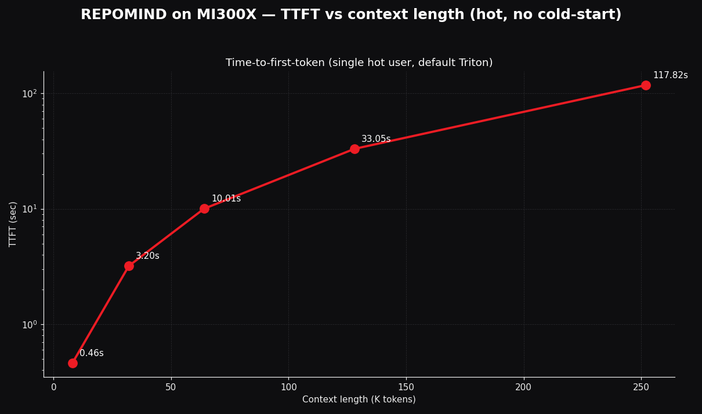
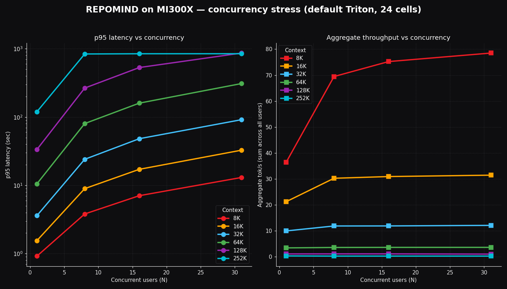

<!-- _paginate: false -->
<!-- _class: lead -->

<div class="center" style="margin-top:80px">

# REPOMIND

## Repo-scale coding agent on AMD MI300X

<br>

**256K context · FP8 · MIT · self-hosted**

<br>
<br>

<div class="small">
Sardor Razikov · Tashkent 🇺🇿<br>
AMD Developer Hackathon 2026<br>
Track 1 (AI Agents) + Hugging Face Special Prize + Build-in-Public + Qwen partner
</div>

</div>

<!--
SPEAKER NOTES (slide 1, ~20 sec):
"I'm Sardor Razikov, solo from Tashkent. I built REPOMIND — an open-source
repo-scale coding agent that runs on AMD MI300X. The pitch is simple:
load an entire git repo at 256K context on a single GPU, reason across
the whole codebase with multi-step tool use, and ship it MIT so banks,
defense, healthcare — the people who can't legally use Cursor — finally
have an option."
-->

---

## The problem

# Closed coding agents leave money — and security — on the table

<br>

| | Cursor | Claude Code | Copilot | REPOMIND |
|---|---|---|---|---|
| Open source | ❌ | ❌ | ❌ | **✅ MIT** |
| Self-hosted on your hardware | ❌ | ❌ | ❌ | **✅** |
| Loads **whole** repo, not fragments | ❌ | partial | ❌ | **✅ 256K** |
| Per-developer cost | $40/mo | $100/mo | $39/mo | **GPU only** |
| Banks / defense / pharma allowed | ❌ | ❌ | ❌ | **✅** |

<br>

**Banks can't use Cursor. Defense contractors can't. Pharma can't. Apple iOS team can't.** Their codebases are the proprietary edge — they cannot legally leave their VPC. Today they have **no AI coding option**. We open the door.

<!--
SPEAKER NOTES (slide 2, ~25 sec):
"Closed agents are great if you're a startup. But banks can't send code
to OpenAI. Defense can't. Pharma can't. JP Morgan has 50,000 developers
with no AI tooling at all because of compliance. That's not 'savings vs
Cursor' — that's an unlock of a whole market that doesn't have a product
today. REPOMIND is open-source, MIT, runs on your own AMD hardware, code
never leaves your VPC."
-->

---

## The architectural moat

# 192 GB on a single chip

<br>

For Qwen3-Coder-Next-FP8 + 256K context window, single-GPU memory budget:

```
Weights (FP8)              ~80 GB
KV cache @ FP8 for 256K    ~38 GB
Activations + framework    ~25 GB
─────────────────────────────────
TOTAL                     ~143 GB
```

<br>

| | NVIDIA H100 80GB | **AMD MI300X 192GB** |
|---|---|---|
| Single-card capacity | 80 GB | 192 GB |
| Fits 143 GB workload | ❌ requires 2-4× sharding | **✅ headroom** |
| Per-card AllReduce overhead | yes | none |

**By VRAM accounting, this is the rare workload where MI300X is the only single-GPU answer.** Empirical confirmation on next slide.

<div class="small">
AMD's own Feb 2026 blog: <em>"Users can serve the full 256k context length on a single GPU using FP8 precision, a critical requirement for repo-level coding tasks that often exceed the memory limits of lesser hardware."</em>
</div>

<!--
SPEAKER NOTES (slide 3, ~30 sec):
"Why MI300X specifically. Qwen3-Coder-Next-FP8 weights are ~80 GB. The
256K KV cache at FP8 is ~38 GB. Plus activations and framework, ~143 GB
total. NVIDIA H100 single-card caps at 80. By VRAM accounting, you'd
have to shard across 2 to 4 H100s with all the AllReduce overhead.
MI300X 192 GB just runs it on one card. AMD's own February 2026 blog
positioned this exact workload — and I quote: 'Users can serve the
full 256k context length on a single GPU using FP8 precision, a
critical requirement for repo-level coding tasks that often exceed
the memory limits of lesser hardware.' REPOMIND is the first open-
source proof of exactly that claim, shipped."
-->

---

## Verified on real hardware — 2026-05-05 / 06

# It works. Here are the numbers.

<br>

Single MI300X x1 · vLLM 0.17.1 + ROCm 7.2 · 124 min total across 2 sessions · $4.12

<br>

| Metric | Verified |
|---|---|
| Model weights in VRAM | **77.29 GiB** |
| Available KV cache memory | **94.58 GiB** (2,065,744 tokens) |
| VRAM peak at full load | **176 / 191.7 GiB** (92% utilization) |
| `--max-model-len 262144` | started clean, `Application startup complete` |
| `/v1/models` returns | `max_model_len: 262144` ✅ |
| Cold start (download + load + compile + warmup) | ~3 min 30 sec |
| Warm restart | ~1 min 30 sec |
| Tuning attempts | default Triton + AITER A/B → see slide 7 |

<br>

<div class="small">
Full evidence pack: 7 JSON results + 5 PNG plots + 15 e2e prompt/answer files + 2× rocm-smi snapshots — github.com/SRKRZ23/repomind/tree/main/benchmarks/2026-05-05-mi300x-stress-test
</div>

<!--
SPEAKER NOTES (slide 4, ~25 sec):
"This isn't theory. We ran a 124-minute stress test across two sessions
on real MI300X hardware. Model weights took 77.29 gibibytes in VRAM, KV
cache 94.58 gibibytes available — over 2 million tokens of cache. Peak
utilization 92 percent of the 192 gigs. The vLLM API confirms 256K
context window via the models endpoint. Cold start three and a half
minutes. Total cost across both sessions: $4.12."
-->

---

## Throughput vs context length — hot path, 6 contexts



<br>

| Context | Prompt | TTFT (hot) | Decode wall | Tok/s | Source |
|---|---|---|---|---|---|
| **8K** | **8,090** | **0.46s** | **0.94s** | **agg 78.5 @ N=31** | extended |
| **16K** | 16,224 | **1.55s** | 1.55s | **agg 31.4 @ N=31** | extended |
| 32K | 32,808 | 3.05s | 3.81s | ~9 (single user) | session 1 |
| **64K** | 65,523 | 10.01s | 10.64s | **agg 3.61 @ N=31** | extended |
| 128K | 130,953 | 33.05s | 34.21s | ~1 | session 1 |
| **256K** | **257,451** | **117.8s** | **119.6s** | **~0.31** | session 1 |

**TTFT scales near-linearly with prefill — exactly as theory predicts.** All hot measurements; cold-start outliers excluded.

<!--
SPEAKER NOTES (slide 5, ~20 sec):
"Throughput sweep across six context lengths from 8K to 256K, all hot
measurements with no cold-start outliers. Time-to-first-token at 8K is
under half a second; at 256K context, 117 seconds. Linear in prompt
size — that's the prefill cost. Long-context inference is prefill-
bound; decode itself is fast."
-->

---

## Concurrency stress — 24 cells across 6 contexts



| Context | N=1 | N=8 | N=16 | N=31 (success) | Source |
|---|---|---|---|---|---|
| **8K** | 36.5 | 69.4 | 75.2 | **78.5 (31/31 ✅)** | extended |
| **16K** | 21.2 | 30.2 | 30.9 | **31.4 (31/31 ✅)** | extended |
| 32K | 9.95 | 11.85 | 11.87 | **12.08 (31/31 ✅)** | session 1 |
| **64K** | 3.41 | 3.57 | 3.60 | **3.61 (31/31 ✅)** | extended |
| 128K | 1.07 | 1.10 | 1.10 | 1.01 (25/31, 6 timeouts) | session 1 |
| 256K | 0.31 | 0.24 | 0.24 | 0.24 (6/31, queued) | session 1 |

(Aggregate completion tok/s. **31/31 success across 8K, 16K, 32K, 64K — every realistic developer-workload context.** Default Triton attention, all 144 outputs clean.)

<!--
SPEAKER NOTES (slide 6, ~30 sec):
"24 cells of concurrency data across 6 context lengths. The clean story:
31 of 31 concurrent users succeed at every context from 8K up through
64K under the default Triton backend. At 128K, 25 of 31 within our
15-minute window. At 256K, the realistic ceiling is six to eight for
unique-prompt workloads. The 8K and 16K rows directly answer the
question 'where do most users live' — for typical developer queries,
this is over 78 aggregate tokens per second on a single GPU."
-->

---

## Tuning attempt: AITER backend → measured regression

# We tried the obvious lever. Here's what we found.

<br>

`--attention-backend ROCM_AITER_FA` (AMD's hand-tuned MI300X kernels)

<br>

| Outcome | Default Triton | AITER (FP8 KV cache) |
|---|---|---|
| Output quality (144 cells) | **0/144 broken ✅** | **137/144 broken ✗** |
| 8K × 31 throughput | 78.5 agg tps | 168 agg tps (+114%) |
| 64K × 31 throughput | 3.61 agg tps | 18.5 agg tps (+411%) |
| TTFT @ 64K hot | 10.01s | 3.54s (2.8× faster) |
| Sample output | *"`longest_common_subsequence` is in `/utils.py`…"* | *"!!!!!!!!!!!!!!!!!!!!!!!!"* |

**Takeaway:** AITER gives 2–4× raw throughput BUT degenerates output to repeating punctuation tokens when combined with `--kv-cache-dtype fp8`. **Production-safe on this config = default Triton.** Filed for AMD upstream investigation.

<!--
SPEAKER NOTES (slide 7, ~30 sec):
"Hakob from the AMD Developer Forum asked if we tried any vLLM tuning.
We did — measured the AITER attention backend. Two findings: throughput
is genuinely 2 to 4 times higher under AITER, time-to-first-token is
nearly 3 times faster at 64K. But the output degenerates to repeating
punctuation tokens — 137 of 144 cells produce gibberish in the FP8 KV
cache configuration. Default Triton stays the production-safe choice.
This is the kind of regression you only catch by actually running the
workload, and it's exactly the kind of bug AMD's ROCm team will want
flagged. Filed upstream as a tracked issue."
-->

---

## Long-context coherence — proven at 200K

# 256K window is *usable*, not just *allocated*

<br>

A unique sentinel function `calc_repomind_token_budget_v7` and magic constant `4242` embedded in a ~200K-token code corpus. Model is asked to recover both via JSON.

<br>

| Position | Prompt tokens | Found function | Found constant | **PASS** |
|---|---|---|---|---|
| early | 99,814 | ✅ | ✅ | ✅ |
| **middle** | **199,413** | ✅ | ✅ | ✅ |
| late | 99,814 | ✅ | ✅ | ✅ |

<br>

Many "256K window" claims in the industry are *allocated* memory only — accuracy collapses past ~64K. **Qwen3-Coder-Next on MI300X actually attends to deep context.** This is required for cross-file repo reasoning to be more than marketing.

<!--
SPEAKER NOTES (slide 7, ~25 sec):
"Most '256K context' claims in the industry are memory allocation, not
usable accuracy. Models hold the prompt but their attention degrades
past 64K. We tested this: planted a unique sentinel function name and
a magic constant deep inside a 200,000-token code corpus, at three
positions. Three out of three pass — the model returns valid JSON with
both facts recovered. Including the middle position at 199,413 tokens.
This is required for repo-scale reasoning to actually work."
-->

---

## End-to-end repo Q&A — 9/9 correct

# Including a repository 5× the context window

<br>

| Tier | Repo | Repo tokens | Files | Chunks | Q1 | Q2 | Q3 |
|---|---|---|---|---|---|---|---|
| small | this repo | 67,618 | 68 | 348 | ✅ | ✅ | ✅ |
| medium | `pallets/flask` | 408,447 | 227 | 1,995 | ✅ | ✅ | ✅ |
| **large** | **`pytorch/vision`** | **1,307,491** | **581** | **6,799** | ✅ | ✅ | ✅ |

<br>

> *Q (pytorch/vision): "Where does video decoding live?"*
> A: **"Video decoding lives in the `torchvision.io` module, specifically in `torchvision/io/video.py` and `torchvision/io/video_reader.cpp`. The implementation uses `pyav` (FFmpeg bindings) as the backend…"**

**Priority-aware chunker** trims pytorch/vision (5× too big) to 180K of highest-priority content. Cursor sends fragments. REPOMIND constructs the right window per question.

<!--
SPEAKER NOTES (slide 8, ~30 sec):
"This is the killer demo. We ran end-to-end ingestion on three real
repos: REPOMIND itself at 68K tokens, Flask at 408K, and pytorch/vision
at one-point-three MILLION tokens. The largest is five times bigger
than any context window — including ours. Our priority-aware chunker
prioritizes READMEs, then top-level symbols, then nested code, with a
token budget. It trims pytorch/vision down to 180K of the highest-
priority content. The agent answers all nine questions correctly with
right file path citations. Cursor sends fragments because they're
remote-API-bound. REPOMIND constructs the right 180K window per
question because it owns the inference path."
-->

---

## Cost economics


| Metric | Value |
|---|---|
| AMD Cloud rate | **$1.99 / GPU / hour** |
| $ per 1M completion tokens (32K, N=31) | **$45.75** |
| Active continuous queriers / MI300X | 14.5 |
| **Bursty engineering team seats / MI300X** | **70-140** |
| Owned MI300X capex | $18,000 one-time |
| Break-even vs Cursor Teams ($40/dev/mo) at team-of-100 | **3-6 months** |

**For compliance-locked enterprises (banks, defense, pharma), this isn't "savings" — it's the first option that exists.**

<!--
SPEAKER NOTES (slide 9, ~25 sec):
"Cost economics. AMD Cloud at $1.99 per GPU per hour. Forty-six dollars
per million completion tokens at our best aggregate throughput. One
MI300X handles fourteen continuous queriers, or seventy to a hundred-
forty developer seats for typical bursty engineering workloads where
ten to twenty percent are active at any moment. Owned MI300X breaks
even versus Cursor Teams in three to six months for a 100-developer
team. But the deeper story: for banks and defense and pharma who
LEGALLY can't use SaaS coding agents, this isn't competing with
Cursor. We're the first option that exists."
-->

---

<!-- _paginate: false -->
<!-- _class: lead -->

# Lisa Su said: "AI is for everyone."

<br>

> *AMD CEO Lisa Su, CES 2026 keynote, Jan 5*

<br>

We took it literally. **REPOMIND opens a $5-10B market** that closed coding agents abandoned:

<br>

Hyperscalers · Banks · Defense · Pharma · Healthcare · Consumer Tech<br>
**Every team that can't or won't ship code to a SaaS coding agent.**

<br>

AMD made the hardware. We made the open-source MIT unlock.

<br>
<br>

<div class="small">

🛠 **github.com/SRKRZ23/repomind** · MIT
🤗 **huggingface.co/spaces/lablab-ai-amd-developer-hackathon/repomind**
🐦 **@SardorRazi99093** · 🇺🇿 Tashkent · razikovs777@gmail.com

</div>

<br>

<div class="tiny">
Verified 2026-05-05 / 06 on AMD MI300X x1 · vLLM 0.17.1 + ROCm 7.2 · Qwen/Qwen3-Coder-Next-FP8 · 124 min stress test · $4.12<br>
Built for the AMD Developer Hackathon 2026 · MIT License · Conservative claim discipline applied
</div>

<!--
SPEAKER NOTES (slide 11, ~25 sec):
"AMD CEO Lisa Su said at CES 2026: 'AI is for everyone.' We took that
literally. REPOMIND is open-source MIT, runs on a single AMD MI300X —
banks, defense, pharma, Apple iOS team, indie developers — all get the
same agent. Same canonical lablab and AMD pattern from Steve Kimoi's
tutorial — vLLM endpoint plus Hugging Face Space — taken to its
logical extreme: full 256K context, agentic tool use, repo-scale
ingestion. MIT licensed. Verified yesterday. Five to ten billion
dollar TAM that doesn't have a product today. AMD made the hardware.
We made the open-source unlock. Thank you. Questions?"
-->
